# System Design Using Infrastructure as Code (IaC)

## Terraform (IaC) with AWS Provider

### Introduction

I will be introducing basic terminologies of system design in relation to cloud computing, so if you are conversant with them you may want to skip to the infrastructure deployment section. I will try to make my documentation as readable as possible as well as caution that this is not a tutorial. I'm still learning IaC with Terraform and thought that I should create a project from scratch on my own just to kick the wheels.

### Case Scenario (Kaseo Restaurants Ltd)

I've chosen an imaginary chain of restaurants (Kaseo Restaurants Ltd) for our case scenario.
Kaseo is a medium sized chain of restaurants with branches all over Europe. They have been operating for 5 years and their main specialty is pizza. They do takeaways, deliveries and people can just eat in if they so wish. All Kaseo's pizza restaurants are amalgamated with a buffet restaurant which they run, people come and make orders, eat and leave.

The problem they have been experiencing since the onset of Covid-19 is that their pizza takeaway has been overwhelmed by massive orders and they just can't cope up. The buffet restaurant is running with a reduced capacity due to social distancing measures and the governments guideline of spasmodic lock-downs. The same problem has been replicated in all the other branches.

Let's envision one of Kaseo's pizza restaurant nearby just to have a feel of how things are going. In this particular restaurant, there are four chefs making pizzas, two making food for the restaurant and two cashiers handling payments. Every two minutes or so the phone rings and one of the cashiers picks it up and takes an order, then return to process payments. Occasionally, a pizza is thrown away because apparently the person who had called and made the order doesn't show up. The delivery guys would pick orders for home deliveries while some customers living nearby would pick their orders personally.

To track their sales and inventory, Kaseo has a software solution which records all pizzas and food sold and saves that in a local database. Daily sales at close down are recorded daily for their monthly accounts which will be amalgamated every quarter with the rest of the branches to have a sense of how the business is performing.

Before I can start to architect a solution, I'll introduce a few concepts which I'll be mentioning often. When I was enrolled in the [AWS re/Start](https://aws.amazon.com/training/restart/) programme, soft skills were emphasized a lot especially the ability to communicate fervently without using tech jargon. This is vital in client facing roles. I will try as much as possible to explain my terminology or create links to redirect you to explanations online.

### Monolithic vs Microservices Architecture

A Monolithic design is built on a single repository or code base. It's more often built with a single programming language with dependencies which affect the whole code base incase there is an update. Although it has less operational overhead, it's a tad too hard to scale like in the case of Kaseo's restaurant as we shall see later on.

A Microservices design on the other hand has small independent component units which carry out their processes independently. They communicate with each other via API calls or HTTP requests. Kaseo restaurant appears to use a monolithic design with components tightly coupled together.

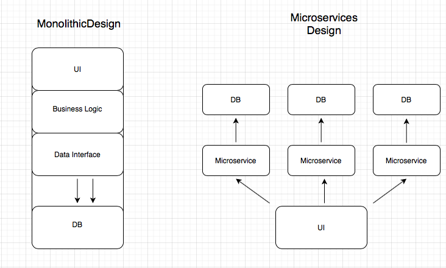

### Distributed Design

A distributed design is composed of microservices which communicate and coordinate work with each other. In system design, concepts of vertical scaling and horizontal scaling are of paramount importance depending on what services your business renders.

#### Vertical and Horizontal Scaling

In the case of Kaseo Restaurants Ltd, let's say that they started their business with one chef who made 10 pizzas an hour. Eventually business picked up and the chef couldn't keep up with making many pizzas at a fast pace. They decided to fire him and employ a professional chef who is able to make 20 pizzas an hour. That is an example of vertical scaling.

Supposing instead of firing the chef they had opted to employ another one so the two could share the work load together. That's an example of horizontal scaling. Problems can arise in the first case scenario if for-instance, the chef contracted Covid and had to isolate for 14 days. That's known as a **single point of failure** because business will not go ahead as the chef is not in. In the second scenario, business would go on albeit slow but at least it's **fault-tolerant**.

### Resilience

Kaseo Restaurants Ltd has learned that if one chef is ill, they would lose business so they came up with a great idea. They decided to find extra chefs who would only come to work to cover up in case one is ill or if all chefs are isolating at home to curb the spread of a dangerous disease. This is a concept of preparing for **disaster recovery**. In computing, we can apply that to the concept of a **Multi-AZ deployment**, where we have a primary and a standby database. The primary synchronously replicates data to a standby instance in a different location. If the primary is down due to some issues, a connection string (Canonical name (CNAME)) would automatically be created and point at the standby (replica) database.

In peak times like weekends and holidays, demand may be higher than usual. We can still ask the extra chefs to come in for work to support the other chefs and leave when demands returns to normal. This is an example of **scalability**.

### High Availability

Kaseo restaurant is doing very well but one evening there is power outage in the whole building which houses the restaurant. BT engineers show up but because its a Sunday, they promise that everything will be operational the following morning from 8 am. Many customers are turned away and Kaseo's management decides to open another branch within the city in Zone B, because the other major branches are in different countries. The new branch grows up tremendously and becomes fully operational in that area.

This concept is knows as **High Availability**. The two restaurants need to be in synch with each other and routing has to be done so that the other restaurant can take orders based on demand. You may find that one chef is an expert in making pizzas, another is an expert in making filet mignon and beef briskets, another is an expert in making desserts, etc. Requests may be routed to specific chefs who are experts in their field, a term known as **separation of concerns**. The system is **distributed** as microservices are shared within the two pizza restaurants.

People living near Zone B need not to go all the way to ZONE A to get their pizzas, a concept known as **low latency**.

### Load Balancing

The problem they face now is when a phone call comes in, they have to manually take the address of the client and see which zone the client resides in, then send the request to the appropriate restaurant depending on which restaurant is less busy.

Supposing the client resides in Zone B, which may be busier in a particular day than Zone-A. If the total time of making the pizza and delivery in Zone-B is 1 hr whilst in Zone-A is 35 min, then a **load balancer** would route traffic to Zone-A which is reasonable as the waiting time is less.

At this point, we have achieved a system whereby load (of requested orders) is distributed within the two zones in each restaurant. Delivery guys are doing their job efficiently. Each chef has his own responsibilities and customers who live near the restaurants in each zone come and pick up their orders, whilst those who want to dine in the restaurant buffet can dine in and have different foods instead of pizzas. This is known as **decoupling** the system.

### Monitoring, Auditing and Logging

At this juncture, we have a *decoupled* system that is *highly available*, *fault tolerant* and *scalable*. Next we may want to enable logging. We may want to know which orders were made and at what time and by who, how long each order took to be processed (time it took the chef to prepare a specific order and time it took the delivery guys to deliver), how each restaurant performs, etc. This metrics will help to identify bottlenecks, hiring decisions, best selling products, etc. 

As an example, you may realise that Margherita pizza (the cheapest) has now become the best seller compared to four cheese pizza two years ago or four season pizza during Christmas. Is it because of the troubled times of Covid that people are going for Margherita? You may also realise that Peperoni pizza sells a lot during bank holidays while the Veggie Pizza is favoured by a certain age group.

This metrics are very important as they help the business with capacity provisioning, inventory and you get an idea of which scaling techniques you'll use eg predictive, dynamic, manual etc.

This solution can be replicated to the other branches and it's what is known as a **high level system design**.

## Infrastructure deployment

Now that we have the various terminologies out of the way, I'll start creating an end-to-end infrastructure on AWS. [CloudFormation](https://docs.aws.amazon.com/AWSCloudFormation/latest/UserGuide/cfn-ug.pdf) is Amazon's Infrastructure as Code (IaC) automation tool but I will be using Terraform which is cloud agnostic as it supports many providers like AWS, Azure, Google Cloud, Kubernetes, Alibaba etc. I started learning Terraform a week ago and the [documentation](https://registry.terraform.io/providers/hashicorp/aws/latest/docs) is very helpful. The language used is HashiCorp Configuration Language (HCL) which is similar to JSON but with additional data structures.

Terraform is an infrastructure/service orchestration automation tool by [HarshiCorp](https://www.terraform.io). Orchestration addresses the needs to automate the lifecycle of environments from provisioning to scaling, de-provisioning and operations.

### VPC and Subnets

A VPC (Virtual Private Cloud) resides inside the AWS network and you can have a maximum of 5 VPC's in each region with each VPC having a capability of up to 200 subnets and a maximum of 5 CIDR (Classless Inter-Domain Routing) blocks. I'll spin a VPC with a CIDR range of 10.0.0.0/16, which is the max in a VPC with 65536 IPs.

Inside the VPC I'll create two public subnets which will house the web servers and Elastic Load Balancer (ELB). The ELB will be an Application ELB (ALB).  ALB's balance HTTP / HTTPS traffic on layer 7 of the [OSI (Open Systems Interconnection)](https://www.cloudflare.com/en-gb/learning/ddos/glossary/open-systems-interconnection-model-osi/) model. I will deploy each on a different [Availability Zone (AZ)](https://docs.aws.amazon.com/AWSEC2/latest/UserGuide/ec2-ug.pdf#using-regions-availability-zones).

```terraform
provider "aws" {
  region     = "eu-west-1"
}

resource "aws_vpc" "kaseo-restaurant-ltd" {
  cidr_block = "10.0.0.0/16"
}

resource "aws_subnet" "kaseo-public-sub-1" {
  vpc_id            = aws_vpc.kaseo-restaurant-ltd.id
  cidr_block        = "10.0.0.0/24"
  availability_zone = "eu-west-1a"
}

resource "aws_subnet" "kaseo-public-sub-2" {
  vpc_id            = aws_vpc.kaseo-restaurant-ltd.id
  cidr_block        = "10.0.1.0/24"
  availability_zone = "eu-west-1b"
}
```

Now that the code is ready I'll run it in bash and see if AWS will create the resources I have defined.

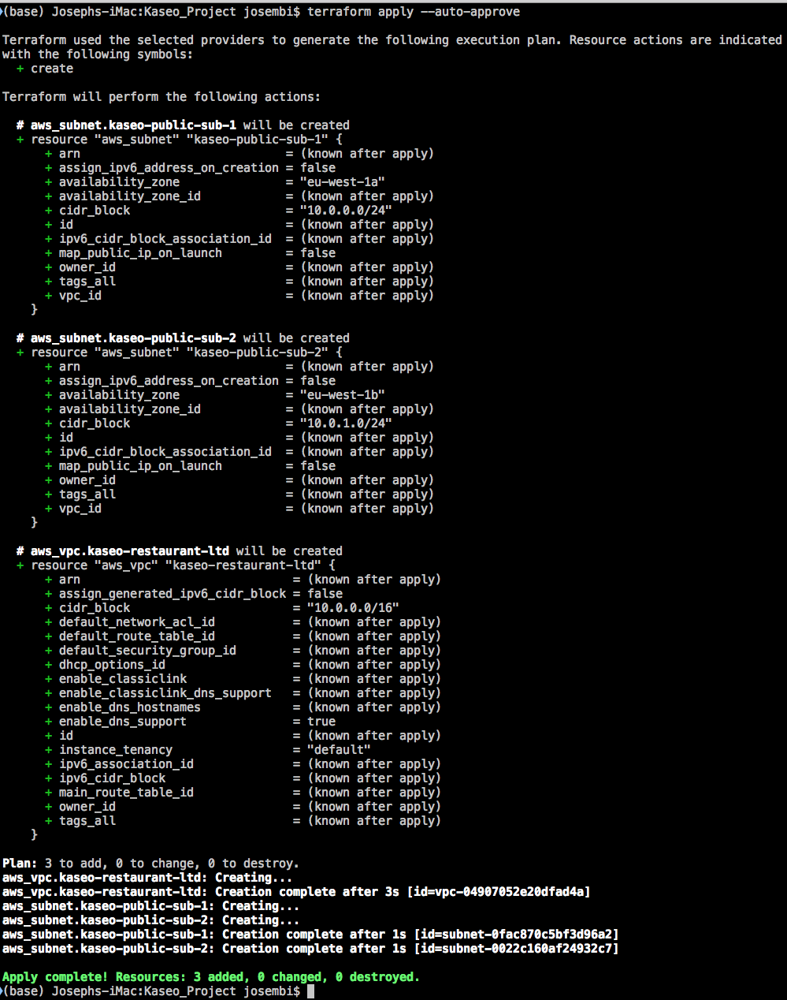

<hr>

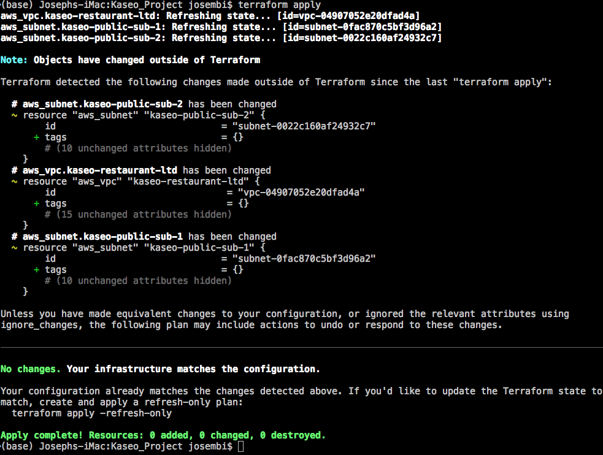

<hr>

The VPC ID created on AWS corresponds to the ID we have on the terraform output
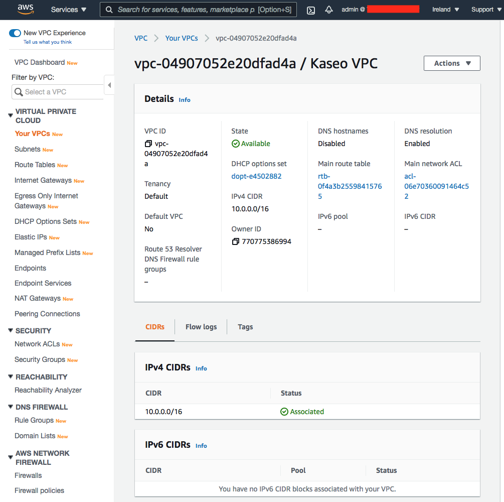

Now that I have a sense of whats happening under the hood, I'll limit myself in adding the bash and the AWS UI screenshots as this file may grow enormously. My VPC now looks like this.
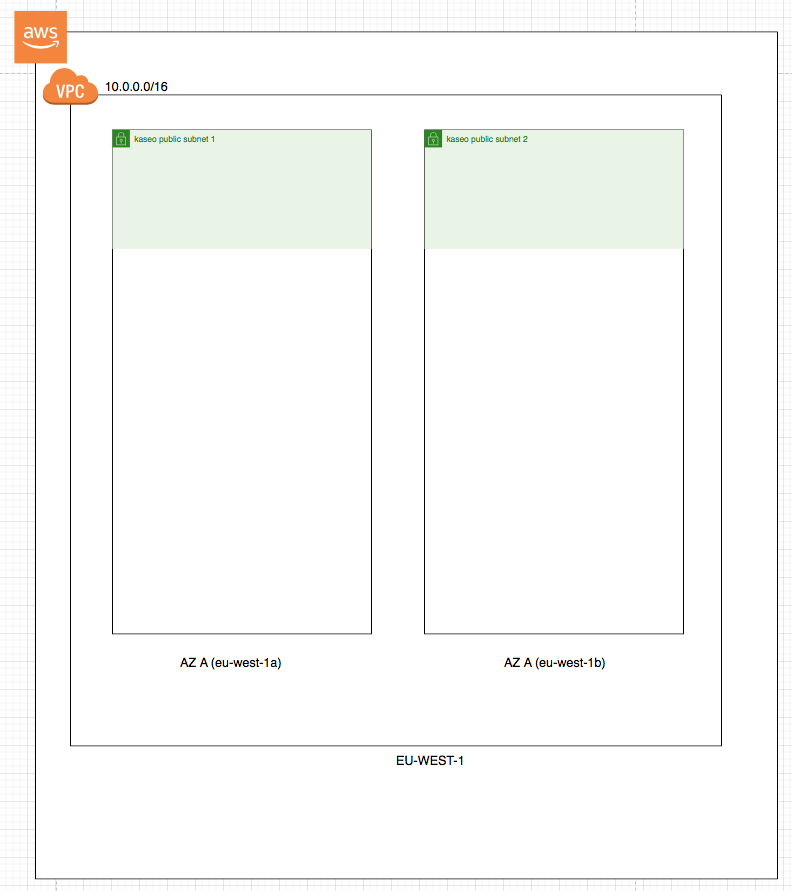

I'll now add private subnets in each AZ. The first pair of private subnets in each AZ will house the database servers and I've made them much bigger (4096 IP's) than the rest of the subnets. The other pair of private subnets (256 IP's in each) will house the company's database and servers. obviously we'll lose 5 IP's in each subnet, the first 4 and the last one which are reserved for routing, DNS and network management.

I've run terraform and created the resources I mentioned above. By default, we have a route table created for us on the fly and a Network Access Control List (NACL). NACL's are firewalls which filter traffic on subnet level based on rules assigned to them. Later on I'll recreate and overwrite the custom resources created by default like the route table and the NACL.

```terraform
provider "aws" {
  region     = "eu-west-1"
}
resource "aws_vpc" "kaseo-restaurant-ltd" {
  cidr_block = "10.0.0.0/16"
  tags = {
    Name : "Kaseo VPC"
  }
}

resource "aws_subnet" "kaseo-public-sub-1" {
  vpc_id            = aws_vpc.kaseo-restaurant-ltd.id
  cidr_block        = "10.0.0.0/24"
  availability_zone = "eu-west-1a"
  tags = {
    Name : "ALB Subnet AZ A"
  }
}

resource "aws_subnet" "kaseo-public-sub-2" {
  vpc_id            = aws_vpc.kaseo-restaurant-ltd.id
  cidr_block        = "10.0.1.0/24"
  availability_zone = "eu-west-1b"
  tags = {
    Name : "ALB Subnet AZ B"
  }
}

resource "aws_subnet" "kaseo-private-sub-1" {
  vpc_id            = aws_vpc.kaseo-restaurant-ltd.id
  cidr_block        = "10.0.16.0/20"
  availability_zone = "eu-west-1a"
  tags = {
    Name : "App Subnet AZ A",
    Servers : "Apache and Nginx"
  }
}

resource "aws_subnet" "kaseo-private-sub-2" {
  vpc_id            = aws_vpc.kaseo-restaurant-ltd.id
  cidr_block        = "10.0.32.0/20"
  availability_zone = "eu-west-1b"
  tags = {
    Name : "App Subnet AZ B",
    Servers : "Apache and Nginx"
  }
}

resource "aws_subnet" "kaseo-private-db-1" {
  vpc_id            = aws_vpc.kaseo-restaurant-ltd.id
  cidr_block        = "10.0.2.0/24"
  availability_zone = "eu-west-1a"
  tags = {
    Name : "DB Subnet AZ A",
    DB : "DynamoDB"
  }
}

resource "aws_subnet" "kaseo-private-db-2" {
  vpc_id            = aws_vpc.kaseo-restaurant-ltd.id
  cidr_block        = "10.0.3.0/24"
  availability_zone = "eu-west-1b"
  tags = {
    Name : "DB Subnet AZ B",
    DB : "DynamoDB"
  }
}

```

The state of the VPC is as below, I will not show the other AZ because the diagram will look too condensed and hard to view as we progress, but the resources are deployed in both AZ's.
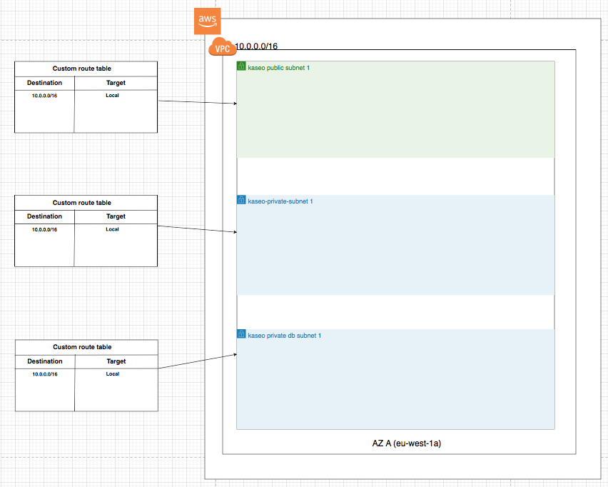

The file is growing, so I'll do some housekeeping and make sure that the configuration is reusable for different environments. I'll create variables to reference the cidr blocks which you can view on the *terraform.tfvars* file.

```terraform
provider "aws" {
  region     = "eu-west-1"
}

variable "vpc_cidr_block" {
  default = "vpc_cidr_block"
}
variable "kaseo-vpc" {
  description = "kaseo manchester area"
}
variable "cidr_blocks-subnets" {
  description = "cidr blocks for subnets"
  type = list(object({
    cidr_block = string
    name       = string
  }))
}

resource "aws_vpc" "kaseo-restaurant-ltd" {
  cidr_block = var.vpc_cidr_block
  tags = {
    Name : var.kaseo-vpc
  }
}

resource "aws_subnet" "kaseo-public-sub-1" {
  vpc_id            = aws_vpc.kaseo-restaurant-ltd.id
  cidr_block        = var.cidr_blocks-subnets[0].cidr_block
  availability_zone = "eu-west-1a"
  tags = {
    Name : "ALB Subnet AZ A"
  }
}

resource "aws_subnet" "kaseo-public-sub-2" {
  vpc_id            = aws_vpc.kaseo-restaurant-ltd.id
  cidr_block        = var.cidr_blocks-subnets[1].cidr_block
  availability_zone = "eu-west-1b"
  tags = {
    Name : "ALB Subnet AZ B"
  }
}

resource "aws_subnet" "kaseo-private-sub-1" {
  vpc_id            = aws_vpc.kaseo-restaurant-ltd.id
  cidr_block        = var.cidr_blocks-subnets[2].cidr_block
  availability_zone = "eu-west-1a"
  tags = {
    Name : "App Subnet AZ A",
    Servers : "Apache and Nginx"
  }
}

resource "aws_subnet" "kaseo-private-sub-2" {
  vpc_id            = aws_vpc.kaseo-restaurant-ltd.id
  cidr_block        = var.cidr_blocks-subnets[3].cidr_block
  availability_zone = "eu-west-1b"
  tags = {
    Name : "App Subnet AZ B",
    Servers : "Apache and Nginx"
  }
}

resource "aws_subnet" "kaseo-private-db-1" {
  vpc_id            = aws_vpc.kaseo-restaurant-ltd.id
  cidr_block        = var.cidr_blocks-subnets[4].cidr_block
  availability_zone = "eu-west-1a"
  tags = {
    Name : "DB Subnet AZ A",
    DB : "DynamoDB"
  }
}

resource "aws_subnet" "kaseo-private-db-2" {
  vpc_id            = aws_vpc.kaseo-restaurant-ltd.id
  cidr_block        = var.cidr_blocks-subnets[5].cidr_block
  availability_zone = "eu-west-1b"
  tags = {
    Name : "DB Subnet AZ B",
    DB : "DynamoDB"
  }
}

output "vpc-id" {
  value = aws_vpc.kaseo-restaurant-ltd.id
}
output "db-id-AZ-1" {
  value = aws_subnet.kaseo-private-db-1.id
}
output "db-id-AZ-2" {
  value = aws_subnet.kaseo-private-db-2.id
}

```

### Internet Gateway and Route Table Subnet Association

Now that the subnets are out of the way, we need inbound and outbound connectivity for our infrastructure.
I'll add a custom route table and an internet gateway and associate them with the public subnets.

```terraform
# Internet Gateway
resource "aws_internet_gateway" "kaseo-igw" {
  vpc_id = aws_vpc.kaseo-restaurant-ltd.id
  tags = {
    Name : "kaseo-rtb"
  }
}

# Route Table
resource "aws_route_table" "kaseo-route-table" {
  vpc_id = aws_vpc.kaseo-restaurant-ltd.id
  route {
    cidr_block = "0.0.0.0/0"
    gateway_id = aws_internet_gateway.kaseo-igw.id
  }
  tags = {
    Name : "kaseo-igw"
  }
}
```

We now have internet access in our public subnets and we can deploy an internet facing ALB with cross-zone load balancing to distribute traffic to EC2 instances.

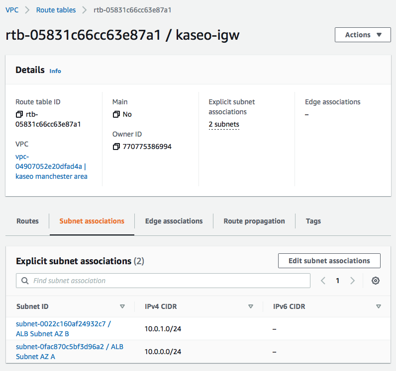
<hr>

This is how our VPC now looks like
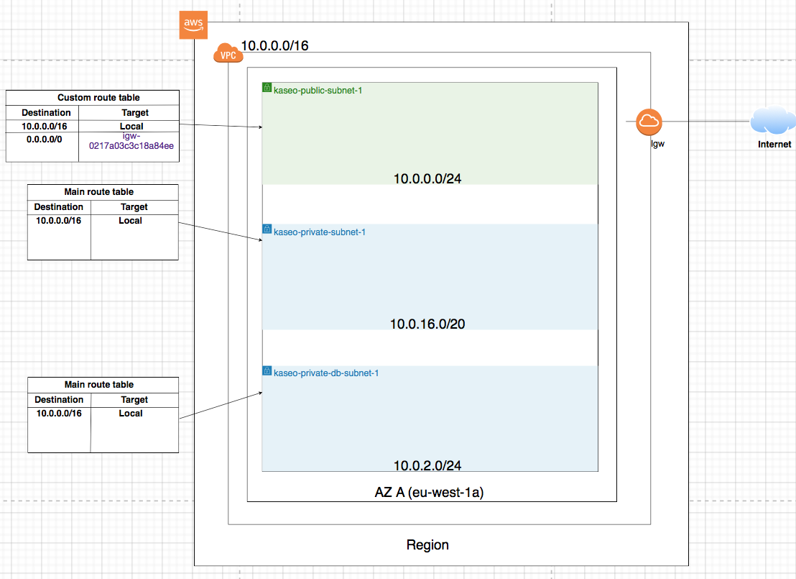

### Security Groups (SG)

Security groups are virtual firewalls that reside in the instance level. They are stateful and rules added filter the traffic to instances. I'll also add an SG to allow traffic from the instances in public subnet to the databases in the private subnet.

The security team may want to SSH or RDP (if using windows) to the instances whilst troubleshooting, so I'll leave port 22 and 3389 open, create a variable for my IP (not my real IP) and configure it in my *.tfvars* file.
In brief, SG's and NACL's are nothing special but network packet filters.

#### Web server SG rules

Allow inbound traffic to HTTP, HTTPS, SSH and RDP endpoints. Allow outbound traffic to all IP's.

```terraform
resource "aws_security_group" "kaseo-webserver-sg" {
  name   = "web-server-sg"
  vpc_id = aws_vpc.kaseo-restaurant-ltd.id
  ingress {
    from_port   = 443
    to_port     = 443
    protocol    = "tcp"
    cidr_blocks = ["0.0.0.0/0"]
  }
  ingress {
    from_port   = 80
    to_port     = 80
    protocol    = "tcp"
    cidr_blocks = ["0.0.0.0/0"]
  }
  ingress {
    from_port   = 22
    to_port     = 22
    protocol    = "tcp"
    cidr_blocks = [var.my_ip]
  }
  ingress {
    from_port   = 3389
    to_port     = 3389
    protocol    = "tcp"
    cidr_blocks = [var.my_ip]
  }
  egress {
    from_port   = 0
    to_port     = 0
    protocol    = "-1"
    cidr_blocks = ["0.0.0.0/0"]
  }
  tags = {
    Name : "ALB SG"
  }

}
```

### Database server rules

RDS is Amazon's managed Relational Database Service (RDS) which has capabilities to support six database engines. In our case, we'll use an RDS MySQL database and thus we'll need to open communication to the web servers on port 3306. Because it's a managed service, we don't need to run updates for patches as Amazon takes care of that. A fully managed NoSQL database is DynamoDB while Aurora serverless (relational) would be ideal if we were unsure on how much capacity we wanted to provision and especially if the business was just starting without a customer base.

```terraform
resource "aws_security_group" "kaseo-db" {
  name        = "db-sg"
  description = "Allow TLS traffic from web-server"
  vpc_id      = aws_vpc.kaseo-restaurant-ltd.id
  # Ingress
  ingress {
    description = "TLS from VPC"
    from_port   = 3306
    to_port     = 3306
    protocol    = "tcp"
  }

  tags = {
    Name = "DB SG"
  }
}
```

### Instances

My AWS account is no longer within the free-tier so I will provision one EC2 instance as an example and it will be terminated when I run **terraform destroy** command. Later on, I'll automate the creation of instances with the autoscaling group where I'll spin 4 instances automatically.

```terraform
# Fetch instance data
data "aws_ami" "latest-amazon-linux-image" {
  most_recent = true
  owners      = ["amazon"]
  filter {
    name   = "name"
    values = ["amzn2-ami-hvm-*-x86_64-gp2"]
  }
  filter {
    name   = "virtualization-type"
    values = ["hvm"]
  }
  filter {
    name   = "root-device-type"
    values = ["ebs"]
  }
}
# Create Instance
resource "aws_instance" "kaseo-server" {
  ami           = data.aws_ami.latest-amazon-linux-image.id
  instance_type = var.instance_type

  subnet_id              = aws_subnet.kaseo-public-sub-1.id
  vpc_security_group_ids = [aws_security_group.kaseo-web-server-sg.id]
  availability_zone      = "eu-west-1a"

  associate_public_ip_address = true
  key_name                    = "kwa-kaseo"
  tags = {
    Name = "Kaseo Webserver"
  }
}

```

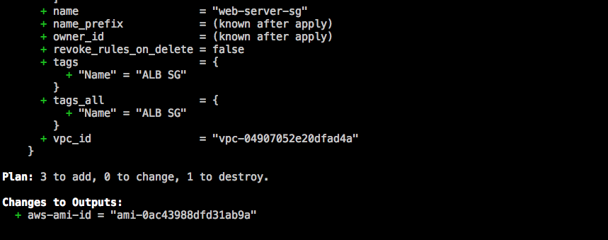

See below the running instance.
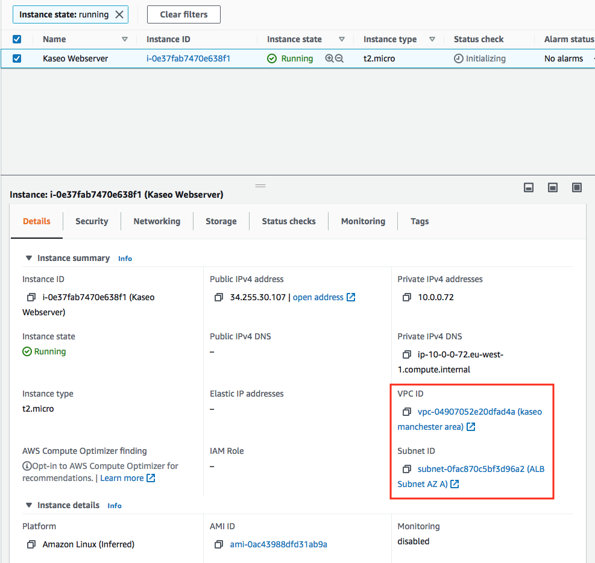

<hr>

See below the security group ports
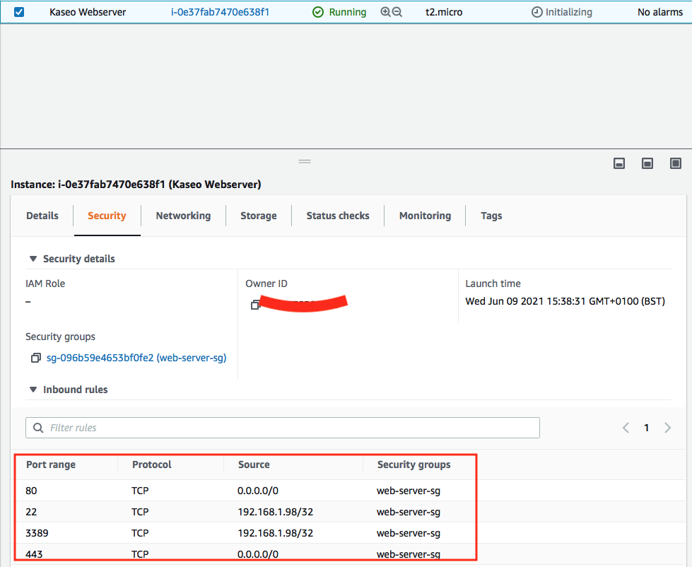

### Autoscaling and Launch Configuration

I'll first create a launch configuration which will aid in the creation of [ami's](https://docs.aws.amazon.com/AWSEC2/latest/UserGuide/AMIs.html). I'll stick to t2-micro's because they are cost efficient.

```terraform
# Launch configuration
resource "aws_launch_configuration" "kaseo-launch-config" {
  name          = "web_config"
  image_id      = data.aws_ami.latest-amazon-linux-image.id
  instance_type = "t2.micro"
  lifecycle {
    create_before_destroy = true
  }
}

# Autoscaling Group
resource "aws_autoscaling_group" "kaseo-autoscaling" {
  name                      = "kaseo-restaurants-manchester"
  availability_zones        = ["eu-west-1a", "eu-west-1b"]
  min_size                  = 2
  max_size                  = 6
  health_check_grace_period = 300
  health_check_type         = "ELB"
  desired_capacity          = 4
  force_delete              = true
  launch_configuration      = aws_launch_configuration.kaseo-launch-config.name

  lifecycle {
    create_before_destroy = true
  }
  tag {
    key                 = "name"
    value               = "kaseo-manchester-ag"
    propagate_at_launch = true
  }

  timeouts {
    delete = "15m"
  }
}
```

### ALB

We need an Application Load Balancer (ALB) to manage the traffic on our public subnets within  the two AZ's. I have configured the ELB to perform health checks so that autoscaling wont terminate or launch instances based on it's own health checks.

Later when the infrastructure is fully deployed and operational, the SysOps team can work closely with the Solutions Architect to tweak the lifecycle hooks using [EventBridge](https://docs.aws.amazon.com/eventbridge/latest/userguide/eb-what-is.html).

```terraform
module "alb" {
  source  = "terraform-aws-modules/alb/aws"
  version = "~> 6.0"

  name = "kaseo-restaurants-alb"

  load_balancer_type = "application"

  vpc_id          = aws_vpc.kaseo-restaurant-ltd.id
  subnets         = ["subnet-066a1d3ba010d66be", "subnet-0fd15976c2f016b7e"]
  security_groups = ["sg-0dc8d12f43eb37fc0"]

  access_logs = {
    bucket = "kaseo-restaurant-logs"
  }

  target_groups = [
    {
      name_prefix      = "pref-"
      backend_protocol = "HTTP"
      backend_port     = 80
      target_type      = "instance"
      targets = [
        {
          target_id = ""
          port      = 80
        },
        {
          target_id = ""
          port      = 8080
        }
      ]
    }
  ]

  https_listeners = [
    {
      port               = 443
      protocol           = "HTTPS"
      certificate_arn    = ""
      target_group_index = 0
    }
  ]

  http_tcp_listeners = [
    {
      port               = 80
      protocol           = "HTTP"
      target_group_index = 0
    }
  ]

  tags = {
    Name = "Kaseo Restaurants Manchester"
  }
}
```

Below is the UI on AWS with 4 instances running as desired. I won't run a script to stress them to trigger the max capacity. What I'll do though is run terraform plan and grab the outputs of the ALB security group and the public subnet ID's because the above module from AWS cannot fetch the ID's directly from my code base with the references I made. As Terraform evolves, hopefully they'll fix that.

Metric logs from the ALB will be stored in an S3 bucket which can be queried using AWS Athena or S3 select for granular queries.

#### Autoscaling

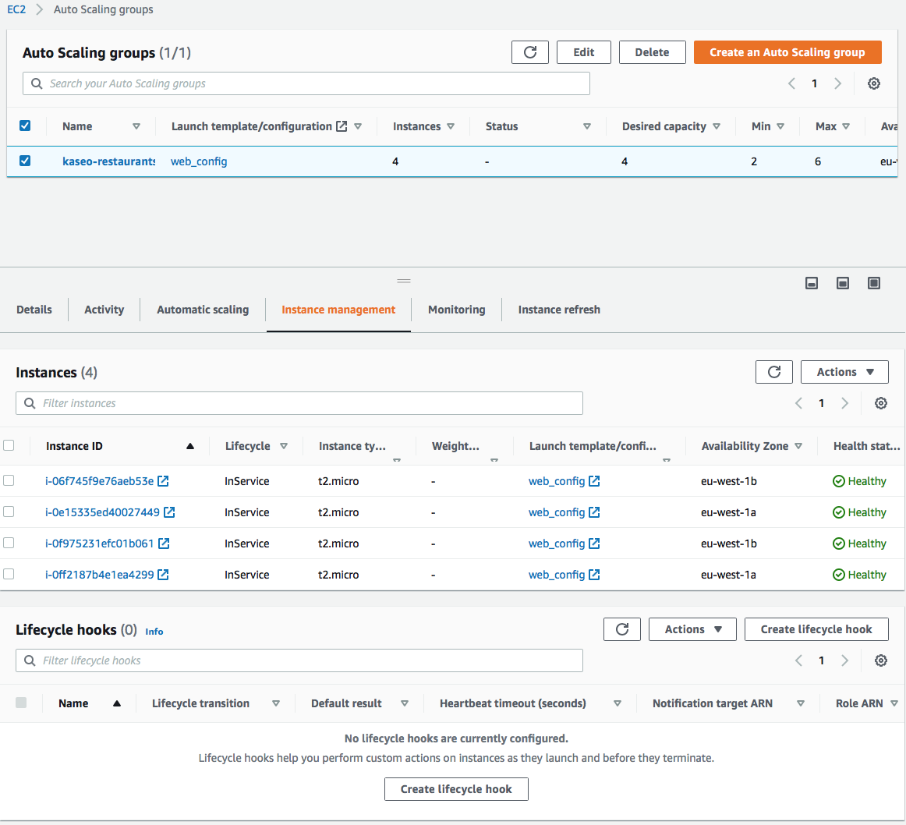
<hr>

#### ALB

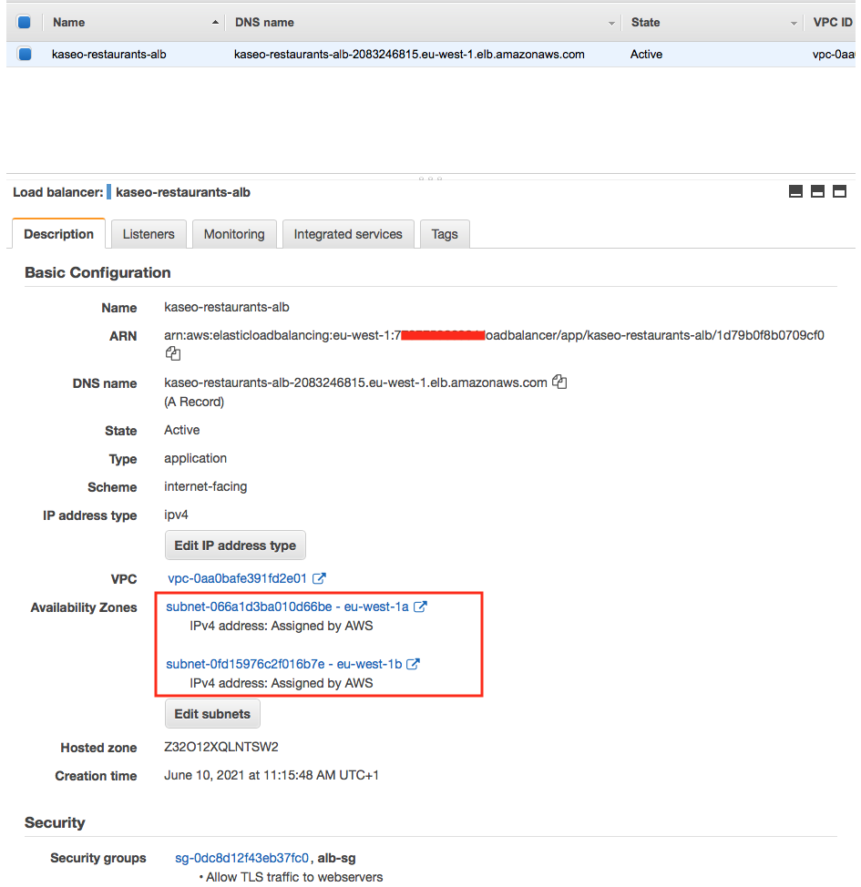

<hr>

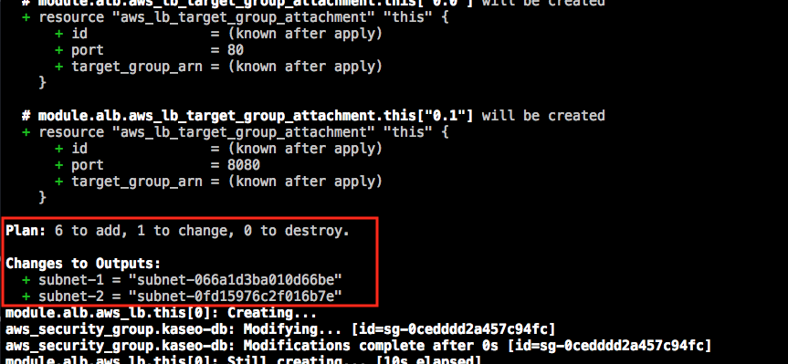

<hr>

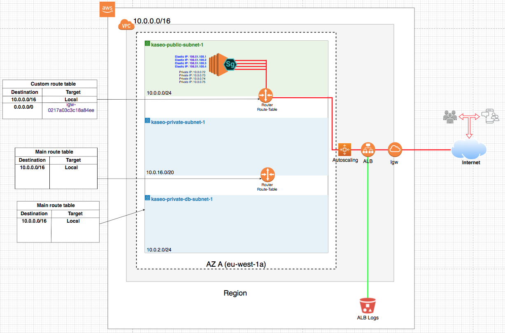

### Database

I will provision an RDS MySQL database for our platform. Since RDS is a managed service we won't worry about running maintenance, security patching or running updates. However, within the [AWS Shared Responsibilities](https://docs.aws.amazon.com/whitepapers/latest/introduction-devops-aws/introduction-devops-aws.pdf#shared-responsibility), we are responsible for IAM configuration eg roles, permissions and scheduling for maintenance and backups.

```terraform
module "db" {
  source  = "terraform-aws-modules/rds/aws"
  version = "~> 2.0"

  identifier = "kaseodb"

  engine            = "mysql"
  engine_version    = "5.7.19"
  instance_class    = "db.t2.large"
  allocated_storage = 5

  name     = "kaseodb"
  username = "joseph"
  password = "NotaRealPassword"
  port     = "3306"

  iam_database_authentication_enabled = true

  vpc_security_group_ids = ["sg-0cedddd2a457c94fc"]

  maintenance_window = "Mon:00:00-Mon:02:00"
  backup_window      = "03:00-04:00"

  monitoring_interval    = "30"
  monitoring_role_name   = "Kaseo-RDS-Monitoring-Role"
  create_monitoring_role = true
  multi_az               = true

  tags = {
    Owner       = "KaseoDB"
    Environment = "Manchester"
  }

  subnet_ids = ["subnet-0f80b56f22f99864d", "subnet-0f4413354d1be32fa"]

  # DB parameter group
  family = "mysql5.7"

  # DB option group
  major_engine_version = "5.7"

  # Snapshot name upon DB deletion
  final_snapshot_identifier = "kaseo-snapshot"

  # Database Deletion Protection
  deletion_protection = true

  parameters = [
    {
      name  = "character_set_client"
      value = "utf8"
    },
    {
      name  = "character_set_server"
      value = "utf8"
    }
  ]

  options = [
    {
      option_name = "MARIADB_AUDIT_PLUGIN"

      option_settings = [
        {
          name  = "SERVER_AUDIT_EVENTS"
          value = "CONNECT"
        },
        {
          name  = "SERVER_AUDIT_FILE_ROTATIONS"
          value = "37"
        },
      ]
    },
  ]
}
```

#### Read Replicas

[Read replicas](https://aws.amazon.com/rds/features/read-replicas/)  make it easy to elastically scale out beyond the capacity constraints of a single DB instance for read-heavy database workloads. Since I have created an RDS MySQL and configured a snapshot, Amazon will use the engines asynchronous replication to update the read replica whenever there is a change to the source DB instance. Terraform doesn't provide a way to create replicas that I am aware of, but I have tried [Cloud Posse](https://github.com/cloudposse/terraform-aws-rds-replica?ref=master) code from their GitHub page and it works. But since I haven't used their code previously and it seems like it's over two years old, I won't use it in production as it may have bugs or other vulnerabilities.

We now have a primary and a stand-by database in AZ A and AZ B respectively. We also have a read replica to offload traffic from the main database which seats in AZ A.

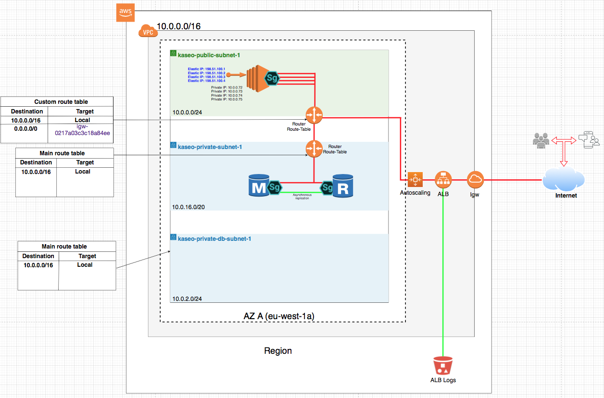

### On-Premises to VPC Connection

Let's try to envision how the infrastructure is in the main branch of Kaseo Pizza Restaurants Ltd. In the morning staff arrive and clock in with their electronic badges. During lunch break, they clock out and in again and in the evening they clock out and leave. This information is stored somewhere in a database within the company. They also have another lightweight database where they monitor their inventory. Other documents like invoices are stored in a hard drive locally and payslips are generated with a software and printed weekly on Fridays and handed over to employees. We need a solution to deploy this in the cloud.

I won't demonstrate that with Terraform because I don't have an on-premises environment and setting one up is expensive. I'll outline it in my drawing anyway.

#### Site-to-Site VPN

Since Kaseo Restaurants Ltd has many restaurants all over Europe, a cost effective solution will be a Site-to-Site VPN connection with all the other branches. I'll create a virtual private gateway in the VPC and a customer gateway on-premises and connect them with an IPsec VPN Tunnel in one of the branches.

After setting up the connection, we can use AWS [Database Migration Service](https://aws.amazon.com/dms/) to migrate the on-prem database to the corporate private subnet. We may need to use the [AWS Schema Conversion Tool](https://aws.amazon.com/dms/schema-conversion-tool/) if migrating an heterogeneous database but because we are not migrating to RDS and since our imaginary database is a lightweight administration of PostgreSQL with a few tables, we can migrate it to an EC2 instance. 

I'll create a NAT (Network Address Translation) gateway in the public subnet to enable internet connectivity incase we want to fetch updates for the corporate/on-premises database. NAT gateways are handy because they enable cloud resources without public IPs to access the internet without exposing those resources and they do not bottleneck like NAT instances which by the way are not Amazon managed. I'll create an extra NAT gateway in the other AZ for high availability.

Since most of the data generated by customers will be in the cloud, we really don't need [Storage Volume Gateway](https://docs.aws.amazon.com/storagegateway/latest/userguide/WhatIsStorageGateway.html) or [DataSync](https://aws.amazon.com/datasync/?whats-new-cards.sort-by=item.additionalFields.postDateTime&whats-new-cards.sort-order=desc) to migrate the corporate data or even setting up a Direct Connection. The VPN tunnel will be enough to do daily ad-hoc updates to the database and to run applications which will be managed by a fleet of EC2 instances and EBS volumes for storage which are cost efficient.

In future if there will be latency issues in the public subnet triggered by rapid growth of the company, a file system like EFS which is ideal for high IOPS and low latencies would be a solution as it can be deployed across multi AZ's.

#### Query ALB Logs Stored in S3 (Simple Storage Service)

Since we have ALB logs in an S3 bucket, we may want to query them just to have a feel of our customer base or if we want to run analytics. We can use AWS Athena which is serverless to run queries on the log files stored in the S3 bucket.

#### Associate Access to Documents

We may also need an S3 bucket to store documents like contracts, payslips, etc for associates who work for Kaseo Restaurants Ltd. We can set up a local identity broker to authenticate associates using the on-prem identity store. After authenticating locally, the identity broker will call the [AWS STS (Security Token Service)](https://docs.aws.amazon.com/STS/latest/APIReference/sts-api.pdf#welcome) Assume Role to get temporary credentials which would enable access to an S3 bucket where the associate documents are stored.

**On-premises Infrastructure.**

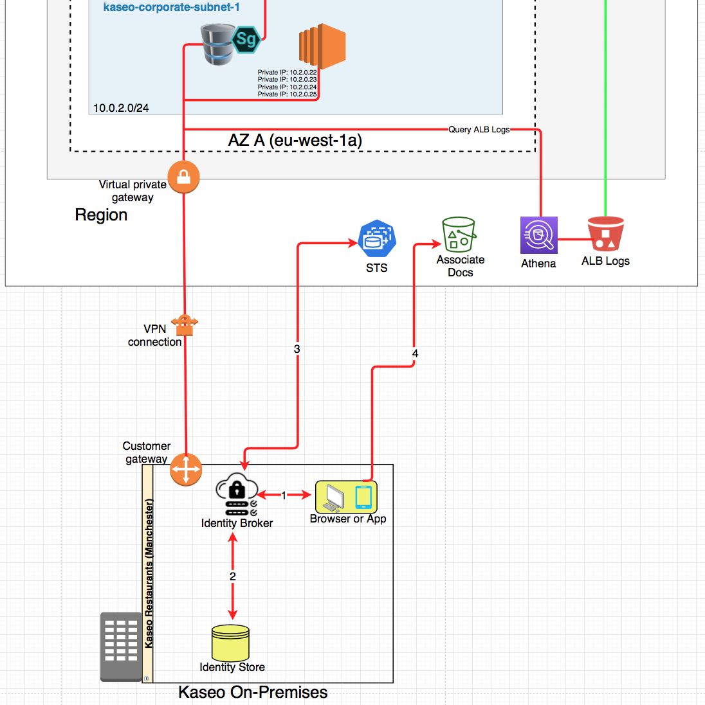

<hr>

**Cloud Infrastructure.**

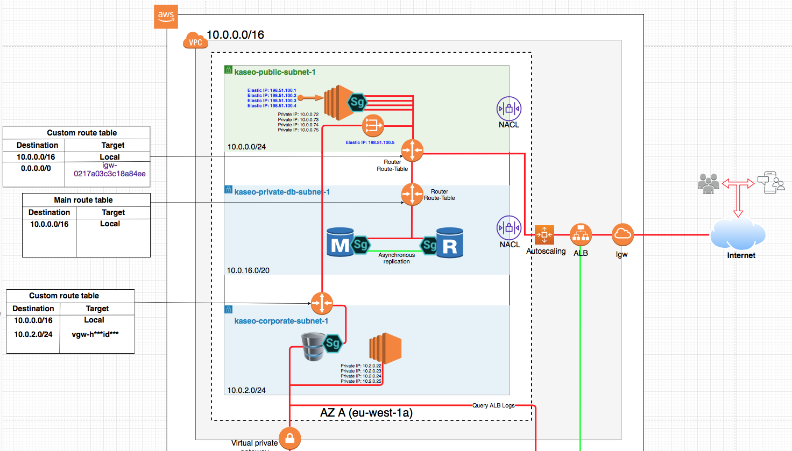

<hr>

**Cloud with on-premises infrastructure.**

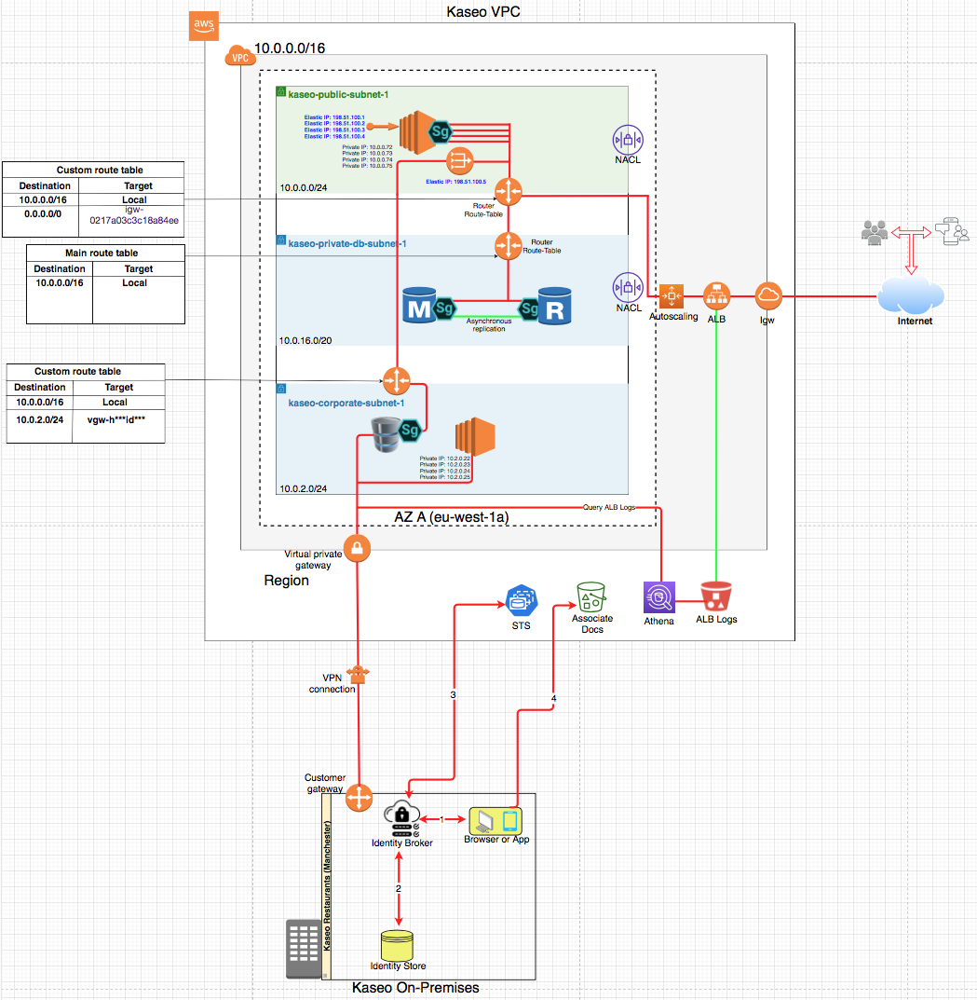

### Deployment of Servers 

Now that the infrastructure is ready servers can be deployed to the public facing EC2 instances and applications can be installed to enable customers to take orders from there. Remember the people who were making fake phone calls to order pizzas and not showing up? Using the app to make orders can be a solution to that problem, as authentication with a payment option may be required.

We can now enable monitoring by using [CloudTrail](https://docs.aws.amazon.com/whitepapers/latest/introduction-devops-aws/introduction-devops-aws.pdf#aws-cloudtrail) to audit all the API calls made within the infrastructure as well as use [CloudWatch Logs](https://docs.aws.amazon.com/whitepapers/latest/introduction-devops-aws/introduction-devops-aws.pdf#amazon-cloudwatch) metrics to monitor and troubleshoot our system and applications. We can use [Systems Manager (SSM)](https://docs.aws.amazon.com/systems-manager/latest/userguide/systems-manager-ug.pdf#sysman-ssm-docs) to automate operational tasks like patching and maintain security, compliance as well as detect policy violations.

If Kaseo Restaurants Ltd continues to grow with a massive customer base, we may want to process orders to our loyal customers first. This can easily be accomplished by using two [AWS SQS](https://docs.aws.amazon.com/AWSSimpleQueueService/latest/SQSDeveloperGuide/sqs-dg.pdf) queues. Requests from customers with a certain number of orders in their accounts (eg more than 4 orders a week) can be channeled to a *high-priority* queue whilst the rest are channeled to a low priority queue.

### Conclusion

We now have a system that adheres to the five pillars of **AWS Well-Architected Framework**. Let's go through them and see what we have achieved so far. 

#### Operational Excellence 

We have a distributed system which can run workloads effectively, gain insights into operations and most important, we can get guidelines from operational failures. One area can be optimised without affecting other areas, eg an Apache server on an EC2 instance can be down for maintenance whilst an Nginx server is still operating. Customers can be encouraged to give feedback via the app about the service or extra services they may need with a reward of a weekly draw of a free pizza. This insights are vital in measuring desired business outcomes.

#### Security

The ability to protect customer data like PCI compliance, securing systems and assets are vital in design. Integrating services like CloudTrail for traceability, keeping unwanted people away from data by applying security at all layers like in our case the use of security groups, NACLs and NAT gateway etc cannot be emphasized enough. 

#### Reliability

We have a system which can perform it's functions correctly and consistently even incase of a disaster. That's why I brought in horizontal scaling with the use of an Autoscaling group and enabled a multi-AZ database deployment for disastor recovery. If one EC2 instance for some reason is down, Autoscaling will automatically spin up a new instance after the ALB health checks fail. 

#### Performance Efficiency 

The need to use computing resources efficiently without wastage is what makes cloud computing important because of it's pay-as-you-go (PAYG) model. On-premises, Kaseo could scale vertically by buying new hardware eg 2 TB SSD drives, 16 Gb ram, etc but will all that capacity be used? Yes they may have very fast computers but they may be utilising only 30 % of it's capabilities. Going serverless like using Lambda and other serverless services like AWS Athena for analytics can not only save money but also provide a system that is performance efficient. 

#### Cost Optimization 

Optimising costs can be achieved in a variety of ways. Since Kaseo Restaurants Ltd will be available for a long time, they can opt to go for capacity reservation of reserved instances which have a significant discount of up to 72 % if reserved for a long period of time. They can anticipate during peak loads to book a block of spot EC2 instances which are super cheap or even go serverless by using API gateway and Lambda. 

After collecting a considerable amount of data via the ALB Logs, customer insights, etc only then they can make further decisions on the trade-offs to consider and tweak further their cloud financial management. 

